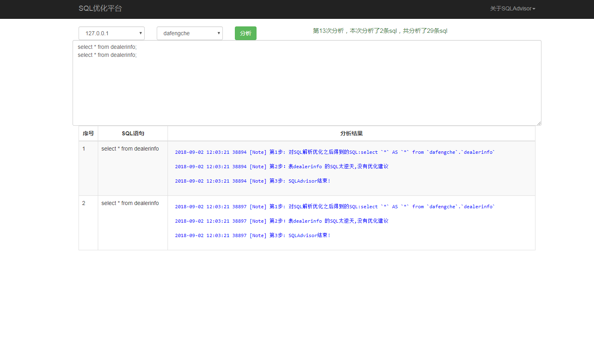

### 基于SQLAdvisor的web界面

### SQLAdvisor简介
SQLAdvisor是由美团点评公司技术工程部DBA团队（北京）开发维护的一个分析SQL给出索引优化建议的工具。它基于MySQL原生态词法解析，结合分析SQL中的where条件、聚合条件、多表Join关系 给出索引优化建议。目前SQLAdvisor在美团点评内部广泛应用，公司内部对SQLAdvisor的开发全面转到github上，开源和内部使用保持一致。

主要功能：输出SQL索引优化建议

### [SQLAdvisor](https://github.com/Meituan-Dianping/SQLAdvisor)

### sqladvisor 安装
sh scripts/installSQLAdvisor.sh

### 运行方式
* nohup python run.py &
